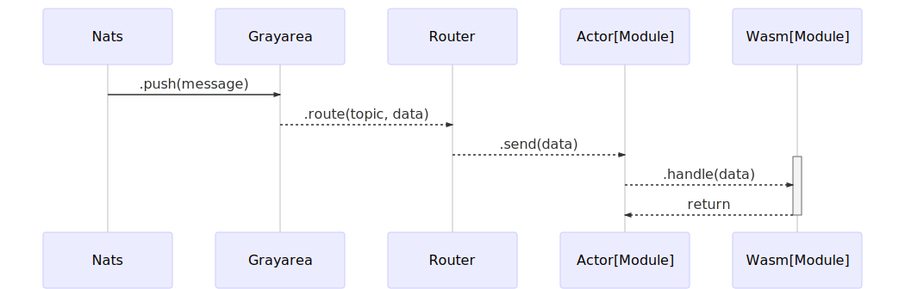
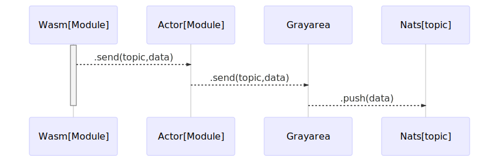

Grayarea is serverless-like runtime capable running functions compiled into WASM/WASI. It is built on top of [Actix](https://docs.rs/actix/0.9.0/actix/) actor system and Wasmer as WASM runtime.

# Features:

 - low functions footprint thanks to WASM
 - high performant [actix system](https://www.techempower.com/benchmarks/#section=data-r18&hw=ph&test=query)
 - actor system is ideal fit for message based communication
 - Nats integration
 - Redis integration
 - Http gateway

### WASM module processing messages from Nats topic:

### WASM module generating messages:

